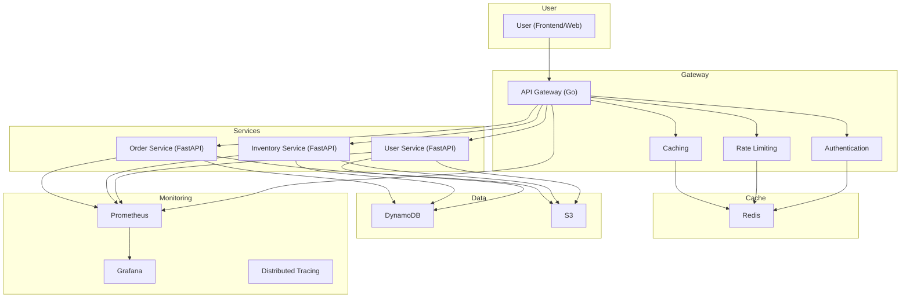

# �� Cloud-Native Order Processor

A comprehensive cloud-native microservice project demonstrating scalable, distributed architecture with security-first design. Built for learning Docker, Kubernetes, Go, Python, and modern DevOps practices with cost-efficient cloud patterns.

## 📋 Project Overview

**Current Focus:** API Gateway, Security, Docker, Kubernetes, Monitoring, and Distributed Systems
**Architecture:** Microservices with API Gateway, Redis Caching, Infrastructure as Code
**Learning Goals:** Go Gateway Development, Python FastAPI, Docker, Kubernetes, AWS Security, Monitoring, CI/CD

### What This Project Teaches
- **API Gateway Development**: Go-based gateway with authentication, rate limiting, caching
- **Microservices Architecture**: Python FastAPI services with Redis integration
- **Security**: JWT, rate limiting, token blacklisting, IAM, secrets management
- **Infrastructure as Code**: Terraform for AWS with K8s deployment
- **Monitoring & Observability**: Prometheus, Grafana, distributed tracing
- **Testing**: Unit, integration, and end-to-end testing strategies
- **Cost Management**: Resource optimization and cleanup automation

## 🏗️ Architecture

### Enhanced System Design
```
┌─────────────┐    ┌─────────────┐    ┌─────────────┐    ┌─────────────┐
│   Frontend  │───▶│   Gateway   │───▶│    Redis    │───▶│   Services  │
│   (React)   │    │   (Go)      │    │             │    │ (FastAPI)   │
│             │    │   (K8s Pod) │    │ (K8s Pod)   │    │ (K8s Pods)  │
└─────────────┘    └─────────────┘    └─────────────┘    └─────────────┘
                              │
                              ▼
                       ┌─────────────┐
                       │  DynamoDB   │
                       │     S3      │
                       │   (AWS)     │
                       └─────────────┘
```

### Component Responsibilities

#### **API Gateway (Go)**
- **Authentication**: JWT validation, session management
- **Rate Limiting**: Per-user request limits and abuse prevention
- **Routing**: Intelligent request routing to appropriate services
- **Caching**: Response caching for performance optimization
- **Security**: Request validation, input sanitization, CORS handling

#### **Redis (In-Memory Store)**
- **Session Management**: User sessions and authentication state
- **Rate Limit Data**: Request counting and limit enforcement
- **Response Cache**: API response caching with TTL
- **Token Blacklist**: Revoked JWT token management

#### **Microservices (FastAPI)**
- **User Service**: Authentication, user management, profiles
- **Inventory Service**: Asset management, categories, pricing
- **Order Service**: Order processing, workflows, status tracking
- **Business Logic**: Core application functionality and data processing

#### **Infrastructure (AWS)**
- **DynamoDB**: Primary data storage for all services
- **S3**: File storage, backups, and asset management
- **EKS**: Kubernetes cluster for container orchestration
- **ALB**: Application load balancer for traffic distribution

### Data Flow


## 📁 Project Structure

```
cloud-native-order-processor/
├── frontend/                 # React frontend application
├── gateway/                  # Go API Gateway (In Progress)
│   ├── src/                 # Gateway source code
│   ├── tests/               # Gateway tests
│   └── Dockerfile           # Gateway containerization
├── services/
│   ├── common/              # Shared Python code, models, DAOs
│   ├── user-service/        # User authentication microservice
│   └── inventory-service/   # Inventory management microservice
├── redis-service/           # Redis operations service (Planned)
│   ├── src/                 # Redis service source code
│   ├── tests/               # Redis service tests
│   └── Dockerfile           # Redis service containerization
├── integration_tests/       # End-to-end integration tests
├── kubernetes/              # K8s deployment manifests
├── terraform/               # Infrastructure as Code
├── monitoring/              # Prometheus, Grafana, alerting
└── scripts/                 # Development and deployment scripts
```

## 🚀 Development Workflow

### 🆕 Enhanced Script Architecture

#### **1. Makefile Commands** (`make`)
- **Quick operations**: `make test`, `make build`, `make deploy`
- **Gateway operations**: `make gateway-build`, `make gateway-test`
- **Service operations**: `make service-build SERVICE=user`, `make service-test SERVICE=inventory`
- **Infrastructure**: `make tf-plan`, `make tf-apply`
- **Cleanup**: `make clean`, `make clean-docker`

#### **2. Focused Development**
- **Gateway development**: `make gateway-dev`
- **Service development**: `make service-dev SERVICE=user`
- **Integration testing**: `make test-integration`
- **Full deployment**: `make deploy-full`

#### **3. Environment Management**
- **Local development**: Docker Compose with gateway and Redis
- **K8s development**: Local K8s cluster with all components
- **Production**: EKS deployment with monitoring and scaling

## 📊 Scaling Strategy

### **Vertically Scalable Components (1 Instance Each)**
- **API Gateway**: 1 instance, vertically scalable (increase CPU/memory as needed)
- **Redis**: 1 instance, vertically scalable (increase CPU/memory as needed)

### **Auto-scaled Components**
- **User Service**: Scale 1-3 instances based on demand
- **Inventory Service**: Scale 2-5 instances based on demand
- **Order Service**: Scale 3-8 instances based on demand
- **Frontend**: Scale 2-3 instances for high availability

### **Scaling Triggers**
- **Gateway/Redis Vertical Scaling**: Scale up when > 80% CPU or > 85% memory
- **Service Horizontal Scaling**: Scale out when > 70% CPU or > 80% memory
- **Response Time**: Scale when latency > 500ms
- **Error Rate**: Scale when error rate > 5%

## 🔒 Security Architecture

### **Network Security**
- **VPC**: Isolated network environment with private subnets
- **Security Groups**: Granular service-to-service communication rules
- **ALB**: Public entry point with SSL termination and WAF integration
- **Private Services**: All services run in private subnets

### **Application Security**
- **JWT Authentication**: Stateless token-based authentication
- **Rate Limiting**: Per-user and per-endpoint request limits
- **Token Blacklisting**: Secure logout with token invalidation
- **Input Validation**: Comprehensive request sanitization
- **CORS**: Cross-origin request handling and security

### **Data Security**
- **Encryption**: Data encrypted in transit and at rest
- **Secrets Management**: K8s secrets for sensitive configuration
- **IAM**: Least privilege access with service-specific roles
- **Audit Logging**: Comprehensive security event tracking

## 📈 Monitoring & Observability

### **Infrastructure Monitoring**
- **Cluster Health**: K8s cluster status and resource utilization
- **Node Metrics**: CPU, memory, disk, and network performance
- **Pod Health**: Service availability and resource consumption
- **Network**: Traffic patterns and bandwidth analysis

### **Application Monitoring**
- **Gateway Metrics**: Request rate, response time, error rate, cache hit rate
- **Redis Metrics**: Memory usage, connection count, command rate, hit rate
- **Service Metrics**: Health status, resource usage, business metrics
- **Dependencies**: Database and external service health monitoring

### **Business Monitoring**
- **User Activity**: Active users, session duration, user journeys
- **Performance**: Response times, throughput, SLA compliance
- **Errors**: Error rates, failure patterns, impact analysis
- **Usage Patterns**: Peak times, traffic distribution, feature usage

## 🔧 Technology Stack

### **Frontend**
- **React**: Modern web application framework
- **TypeScript**: Type-safe JavaScript development
- **Vite**: Fast build tool and development server

### **Backend**
- **Go**: High-performance API Gateway
- **Python**: FastAPI microservices
- **Redis**: In-memory caching and session storage

### **Infrastructure**
- **Docker**: Containerization and development
- **Kubernetes**: Container orchestration and scaling
- **Terraform**: Infrastructure as Code
- **AWS**: Cloud infrastructure and managed services

### **Monitoring**
- **Prometheus**: Metrics collection and storage
- **Grafana**: Visualization and dashboards
- **Jaeger**: Distributed tracing
- **ELK Stack**: Log aggregation and analysis

## 📋 Implementation Status

### ✅ Completed
- [x] Basic microservices (user, inventory)
- [x] Docker containerization
- [x] Kubernetes deployment
- [x] Terraform infrastructure
- [x] Unit testing and coverage
- [x] CI/CD pipeline
- [x] Integration testing framework

### 🔄 In Progress
- [ ] **API Gateway (Go)**: Core gateway functionality
- [ ] **Redis Integration**: Session management and caching
- [ ] **Security Enhancement**: Rate limiting and token blacklisting
- [ ] **Monitoring Setup**: Prometheus and Grafana deployment

### 📋 Planned
- [ ] **Redis Service**: Dedicated Redis operations service
- [ ] **Order Service**: Order processing microservice
- [ ] **Advanced Caching**: Multi-level caching strategies
- [ ] **Distributed Tracing**: Request tracing across services
- [ ] **Load Testing**: Performance and scalability testing
- [ ] **Security Hardening**: Advanced security features
- [ ] **Multi-environment**: Staging and production environments

### 🚀 Future Enhancements
- [ ] **Real-time Features**: WebSocket support
- [ ] **Advanced Analytics**: Business intelligence and reporting
- [ ] **Compliance Features**: GDPR, SOC2 compliance
- [ ] **Multi-region**: Geographic distribution
- [ ] **Service Mesh**: Advanced service communication
- [ ] **Machine Learning**: Predictive analytics and automation

## 💰 Cost Management
- **Resource Optimization**: Right-sized instances and auto-scaling
- **Cost Monitoring**: AWS cost tracking and alerting
- **Cleanup Automation**: Automatic resource cleanup scripts
- **Development Efficiency**: Local development to reduce cloud costs

## 🎯 Learning Outcomes
- **API Gateway Patterns**: Industry-standard gateway architecture
- **Microservices Security**: Distributed security best practices
- **Performance Optimization**: Caching and scaling strategies
- **Observability**: Comprehensive monitoring and debugging
- **Cloud-Native Development**: Modern development practices
- **DevOps Automation**: CI/CD and infrastructure automation

---

**This project demonstrates a production-ready, scalable microservices architecture with security-first design and comprehensive monitoring.** 🚀