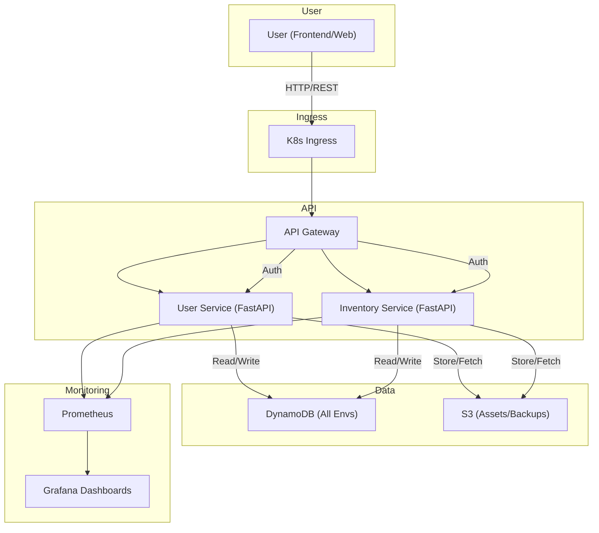

# 🚀 Cloud-Native Order Service

A hands-on cloud-native microservice project focused on learning Docker, Kubernetes, security, and modern DevOps practices. The stack is designed for cost efficiency and practical experimentation, using DynamoDB (not RDS/PostgreSQL) for all data storage.

## 📋 Project Overview

**Current Focus:** User Authentication, Docker, Kubernetes, Security, and Monitoring
**Architecture:** Microservices, Infrastructure as Code, Cost-Efficient Cloud Patterns
**Learning Goals:** Docker, Kubernetes, AWS IAM/Security, Monitoring, CI/CD, and Infrastructure Automation

### What This Project Teaches
- **Docker & Kubernetes**: Containerization, orchestration, and deployment
- **Security**: JWT, IAM, secrets management, least privilege
- **Infrastructure as Code**: Terraform for AWS
- **API Development**: FastAPI (Python)
- **Monitoring**: K8s monitoring (in progress)
- **Testing**: Unit, integration, and E2E
- **Cost Management**: Resource cleanup, minimal AWS usage

## 🏗️ Architecture

### Current Implementation
```
┌───────────────┐    ┌───────────────┐    ┌───────────────┐
│ Development   │    │ Production    │    │  Monitoring   │
│               │    │               │    │               │
│ EKS/K8s       │    │ EKS/K8s       │    │ Prometheus    │
│ FastAPI       │    │ FastAPI       │    │ Grafana       │
│ Docker        │    │ Docker        │    │ Dashboards    │
└───────────────┘    └───────────────┘    └───────────────┘
```

### Services Architecture
```
cloud-native-order-processor/
├── frontend/                 # Web frontend (React + Vite)
├── services/
│   ├── common/               # Shared Python code, models, DAOs
│   ├── inventory-service/    # Inventory microservice (FastAPI)
│   └── user-service/         # User authentication microservice (FastAPI)
├── integration_tests/        # Integration and smoke tests (Python)
```

### Data Flow


**Note:**
- EKS (or local K8s) runs FastAPI microservices in Docker containers.
- Monitoring uses Prometheus for metrics collection and Grafana for dashboards.
- DynamoDB is used for all environments for cost efficiency and simplicity. RDS/PostgreSQL is not used or planned.
- Focus is on Docker, Kubernetes, security, and monitoring best practices.

## 🚀 Quick Start

### Prerequisites
- Python 3.11+
- AWS CLI configured
- Terraform ≥ 1.5.0
- Docker Desktop
- Git

### Local Development
```bash
# 1. Clone and setup
git clone <repository-url>
cd cloud-native-order-processor

# 2. Run full development cycle
./scripts/test-local.sh --environment dev --full-test

# 3. Or run individual steps
./scripts/deploy.sh --environment dev        # Deploy infrastructure
./scripts/deploy-app.sh --environment dev    # Deploy application
./scripts/test-integration.sh --environment dev  # Run tests
./scripts/destroy.sh --environment dev --force   # Clean up
```

### Run Tests Only
```bash
cd services/common
python3 -m venv .venv
source .venv/bin/activate
pip install -r requirements.txt
pytest tests/test_models/ -v --cov=src/models
```

## 🔧 Development Workflow

```bash
# Deploy infrastructure
./scripts/deploy.sh --environment dev
# Deploy app updates
./scripts/deploy-app.sh --environment dev --skip-build
# Run integration tests
./scripts/test-integration.sh --environment dev
# Clean up resources
./scripts/destroy.sh --environment dev --force
```

## 🧪 Testing Strategy
- **Unit Tests**: Fast, isolated, core logic
- **Integration Tests**: API/database
- **E2E Tests**: User workflows
- **Coverage**: >90% on business logic

## 🛠️ Technology Stack
- **Backend**: FastAPI (Python 3.11)
- **Auth**: JWT, bcrypt
- **Frontend**: React + Vite
- **Infra**: Terraform, AWS (DynamoDB, S3, EKS)
- **Containers**: Docker, Kubernetes
- **CI/CD**: GitHub Actions
- **Secrets**: AWS Secrets Manager, K8s secrets
- **Monitoring**: Prometheus, Grafana

## 📦 Project Structure
```
cloud-native-order-processor/
├── config/                   # Environment configurations
├── docker/                   # Docker and container configs
├── docs/                     # Documentation
├── frontend/                 # Web frontend (React + Vite)
├── integration_tests/        # Integration and smoke tests (Python)
├── kubernetes/               # K8s manifests, scripts, secrets
├── logs/
├── scripts/                  # Deployment, build, and utility scripts
│   └── shared/
├── services/                 # Microservices code
│   ├── common/               # Shared Python code, models, DAOs
│   ├── inventory-service/    # Inventory microservice (FastAPI)
│   └── user-service/         # User authentication microservice (FastAPI)
├── terraform/                # Infrastructure as code (Terraform)
│   └── scripts/
├── venv/                     # Python virtual environment (local)
├── Makefile, README.md, etc.
```

## 🎯 Roadmap & Learning Plan

### Foundation
- [x] User authentication (JWT)
- [x] Unit testing & coverage
- [x] Terraform automation
- [x] CI/CD pipeline
- [x] Docker containerization

### Core Services
- [ ] Trading/order endpoints
- [ ] Integration testing
- [ ] Kubernetes deployment
- [ ] API rate limiting/caching

### Production Features
- [ ] Security hardening
- [ ] Monitoring/alerting
- [ ] Load/performance testing
- [ ] Multi-environment deployment

### Advanced/Scale
- [ ] Real-time/WebSocket support
- [ ] Compliance features
- [ ] Advanced analytics
- [ ] Multi-region/service mesh

## 💰 Cost Management
- DynamoDB and other AWS resources are used for cost efficiency.
- Always run `destroy.sh --force` after development to avoid charges.
- Monitor AWS billing regularly.

## 🤝 Contributing
Personal learning project. Feedback on architecture, security, and DevOps is welcome.

## 📚 Learning Resources
- [FastAPI](https://fastapi.tiangolo.com/)
- [Terraform AWS Provider](https://registry.terraform.io/providers/hashicorp/aws/latest/docs)
- [Kubernetes Docs](https://kubernetes.io/docs/)
- [AWS Well-Architected](https://aws.amazon.com/architecture/well-architected/)

## 🔐 Security Considerations
- JWT tokens, secret management
- Password hashing (bcrypt)
- IAM least privilege
- Container security scanning
- Input validation (Pydantic)

## 📄 License
Educational use only. Learn and adapt freely.