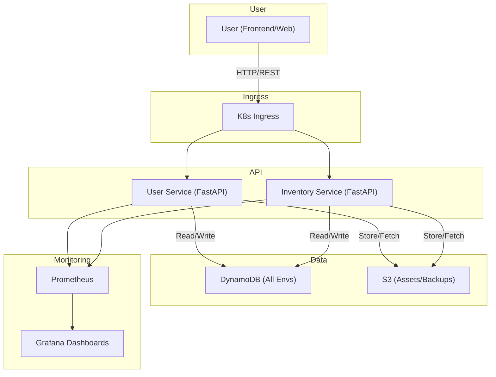

# 🚀 Cloud-Native Order Service

A hands-on cloud-native microservice project focused on learning Docker, Kubernetes, security, and modern DevOps practices. The stack is designed for cost efficiency and practical experimentation, using DynamoDB (not RDS/PostgreSQL) for all data storage.

## 📋 Project Overview

**Current Focus:** User Authentication, Docker, Kubernetes, Security, and Monitoring
**Architecture:** Microservices, Infrastructure as Code, Cost-Efficient Cloud Patterns
**Learning Goals:** Docker, Kubernetes, AWS IAM/Security, Monitoring, CI/CD, and Infrastructure Automation

### What This Project Teaches
- **Docker & Kubernetes**: Containerization, orchestration, and deployment
- **Security**: JWT, IAM, secrets management, least privilege
- **Infrastructure as Code**: Terraform for AWS
- **API Development**: FastAPI (Python)
- **Monitoring**: K8s monitoring (in progress)
- **Testing**: Unit, integration, and E2E
- **Cost Management**: Resource cleanup, minimal AWS usage

## 🏗️ Architecture

### Current Implementation
```
┌───────────────┐    ┌───────────────┐    ┌───────────────┐
│ Development   │    │ Production    │    │  Monitoring   │
│               │    │               │    │               │
│ EKS/K8s       │    │ EKS/K8s       │    │ Prometheus    │
│ FastAPI       │    │ FastAPI       │    │ Grafana       │
│ Docker        │    │ Docker        │    │ Dashboards    │
└───────────────┘    └───────────────┘    └───────────────┘
```

### Services Architecture
```
cloud-native-order-processor/
├── frontend/                 # Web frontend (React + Vite)
├── services/
│   ├── common/               # Shared Python code, models, DAOs
│   ├── inventory-service/    # Inventory microservice (FastAPI)
│   └── user-service/         # User authentication microservice (FastAPI)
├── integration_tests/        # Integration and smoke tests (Python)
```

### Data Flow


**Note:**
- EKS (or local K8s) runs FastAPI microservices in Docker containers.
- K8s Ingress routes traffic directly to FastAPI services (no API Gateway).
- Monitoring uses Prometheus for metrics collection and Grafana for dashboards.
- DynamoDB is used for all environments for cost efficiency and simplicity. RDS/PostgreSQL is not used or planned.
- Focus is on Docker, Kubernetes, security, and monitoring best practices.

## 🚀 Quick Start

### Prerequisites
- Python 3.11+
- AWS CLI configured
- Terraform ≥ 1.5.0
- Docker Desktop
- Git

### 🎯 Quick Commands (Recommended)

#### Using Makefile (Simplest)
```bash
# Setup and start development
make dev-setup
make dev-start

# Run tests
make test

# Build and deploy
make build
make deploy-dev

# Clean up
make clean
```

#### Using Makefile for Focused Development
```bash
# Setup development environment
make dev-setup

# Start individual services (focus on what you're working on)
make dev-user-service      # Start user service only
make dev-inventory-service # Start inventory service only
make dev-frontend          # Start frontend only

# Test current service
make test-current SERVICE=user_service
make test-current SERVICE=inventory_service

# Full integration test (when needed)
make test-integration
```

#### Using Terraform Scripts
```bash
# Initialize and deploy infrastructure
./terraform/scripts/terraform-ops.sh init -e dev
./terraform/scripts/terraform-ops.sh plan -e dev
./terraform/scripts/terraform-ops.sh apply -e dev -y

# Run infrastructure tests
./terraform/scripts/terraform-ops.sh test -e dev

# Clean up
./terraform/scripts/terraform-ops.sh destroy -e dev
```

### 🔧 Legacy Commands (Still Available)
```bash
# Full development cycle
./scripts/test-local.sh --environment dev --full-test

# Individual steps
./scripts/deploy.sh --environment dev
./scripts/deploy-app.sh --environment dev
./scripts/test-integration.sh --environment dev
./scripts/destroy.sh --environment dev --force
```

### Run Tests Only
```bash
# Backend tests
make test-backend

# Frontend tests (when configured)
make test-frontend

# Infrastructure tests
make test-infra
```

## 🔧 Development Workflow

### 🆕 New Script Architecture

We've introduced a comprehensive script system for better development experience:

#### **1. Makefile Commands** (`make`)
- **Quick operations**: `make test`, `make build`, `make deploy`
- **Development shortcuts**: `make dev-setup`, `make dev-start`
- **Infrastructure**: `make tf-plan`, `make tf-apply`
- **Cleanup**: `make clean`, `make clean-docker`

#### **2. Focused Development** (`make`)
- **Individual services**: Start only what you're working on
- **Quick testing**: Test current service without full integration
- **Microservice focus**: Each service works independently
- **Integration when needed**: Full test cycle only when required

#### **3. Terraform Operations** (`./terraform/scripts/terraform-ops.sh`)
- **Unified interface**: Single script for all Terraform operations
- **Environment support**: Easy switching between dev/prod
- **Safety features**: Confirmation prompts for destructive operations
- **Integration**: Works with existing infrastructure tests

### Legacy Workflow (Still Available)
```bash
# Deploy infrastructure
./scripts/deploy.sh --environment dev
# Deploy app updates
./scripts/deploy-app.sh --environment dev --skip-build
# Run integration tests
./scripts/test-integration.sh --environment dev
# Clean up resources
./scripts/destroy.sh --environment dev --force
```

## 🧪 Testing Strategy
- **Unit Tests**: Fast, isolated, core logic
- **Integration Tests**: API/database
- **E2E Tests**: User workflows
- **Coverage**: >90% on business logic

## 🛠️ Technology Stack
- **Backend**: FastAPI (Python 3.11)
- **Auth**: JWT, bcrypt
- **Frontend**: React + Vite
- **Infra**: Terraform, AWS (DynamoDB, S3, EKS)
- **Containers**: Docker, Kubernetes
- **CI/CD**: GitHub Actions
- **Secrets**: AWS Secrets Manager, K8s secrets
- **Monitoring**: Prometheus, Grafana

## 🏗️ Infrastructure Improvements

### **Enhanced Terraform Constants** (`terraform/locals.tf`)
- **Centralized naming**: All resource names in one place
- **Environment-specific**: Different configurations for dev/prod
- **Easy updates**: Change project name, environment, or naming patterns
- **Consistent patterns**: All resources follow the same naming convention

### **Improved IAM Organization**
- **Hybrid approach**: Core IAM in `iam.tf`, resource-specific policies in respective files
- **Self-contained**: Each resource file contains its own IAM policy
- **Easy to understand**: See exactly what permissions each resource needs
- **Maintainable**: Changes to a resource include its permissions

**Example:**
```hcl
# In dynamodb.tf
resource "aws_dynamodb_table" "users" {
  name = local.db_names.users_table  # Uses centralized constant
}

# DynamoDB-specific IAM policy in the same file
resource "aws_iam_policy" "dynamodb_access" {
  # Policy definition
}
```

## 📦 Project Structure
```
cloud-native-order-processor/
├── config/                   # Environment configurations
├── docker/                   # Docker and container configs
├── docs/                     # Documentation
├── frontend/                 # Web frontend (React + Vite)
├── integration_tests/        # Integration and smoke tests (Python)
├── kubernetes/               # K8s manifests, scripts, secrets
├── logs/
├── scripts/                  # Deployment, build, and utility scripts
│   └── shared/
├── services/                 # Microservices code
│   ├── common/               # Shared Python code, models, DAOs
│   ├── inventory-service/    # Inventory microservice (FastAPI)
│   └── user-service/         # User authentication microservice (FastAPI)
├── terraform/                # Infrastructure as code (Terraform)
│   └── scripts/
├── venv/                     # Python virtual environment (local)
├── Makefile, README.md, etc.
```

## 🎯 Roadmap & Learning Plan

### Foundation
- [x] User authentication (JWT)
- [x] Unit testing & coverage
- [x] Terraform automation
- [x] CI/CD pipeline
- [x] Docker containerization

### Core Services
- [ ] Trading/order endpoints
- [ ] Integration testing
- [ ] Kubernetes deployment
- [ ] API rate limiting/caching

### Production Features
- [ ] Security hardening
- [ ] Monitoring/alerting
- [ ] Load/performance testing
- [ ] Multi-environment deployment

### Advanced/Scale
- [ ] Real-time/WebSocket support
- [ ] Compliance features
- [ ] Advanced analytics
- [ ] Multi-region/service mesh

## 💰 Cost Management
- DynamoDB and other AWS resources are used for cost efficiency.
- Always run `destroy.sh --force` after development to avoid charges.
- Monitor AWS billing regularly.

## 🤝 Contributing
Personal learning project. Feedback on architecture, security, and DevOps is welcome.

## 📚 Learning Resources
- [FastAPI](https://fastapi.tiangolo.com/)
- [Terraform AWS Provider](https://registry.terraform.io/providers/hashicorp/aws/latest/docs)
- [Kubernetes Docs](https://kubernetes.io/docs/)
- [AWS Well-Architected](https://aws.amazon.com/architecture/well-architected/)

## 🔐 Security Considerations
- JWT tokens, secret management
- Password hashing (bcrypt)
- IAM least privilege
- Container security scanning
- Input validation (Pydantic)

## 📄 License
Educational use only. Learn and adapt freely.

You can run it from your project root with:
```bash
python services/inventory_service/src/services/fetch_coingecko.py
```

Let me know if you need help running it or want to move it elsewhere!